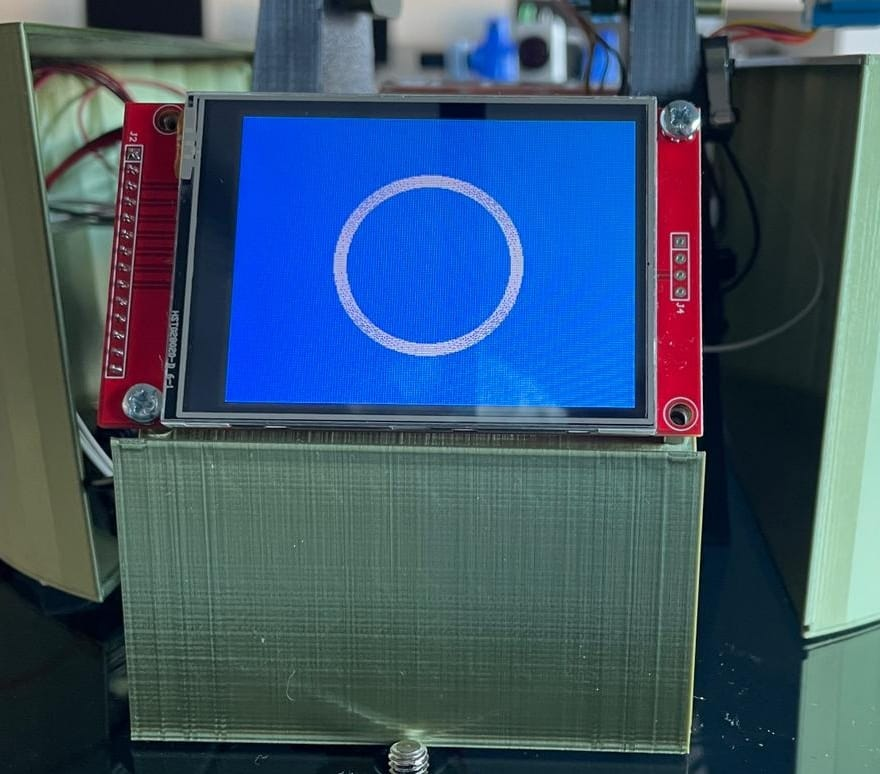
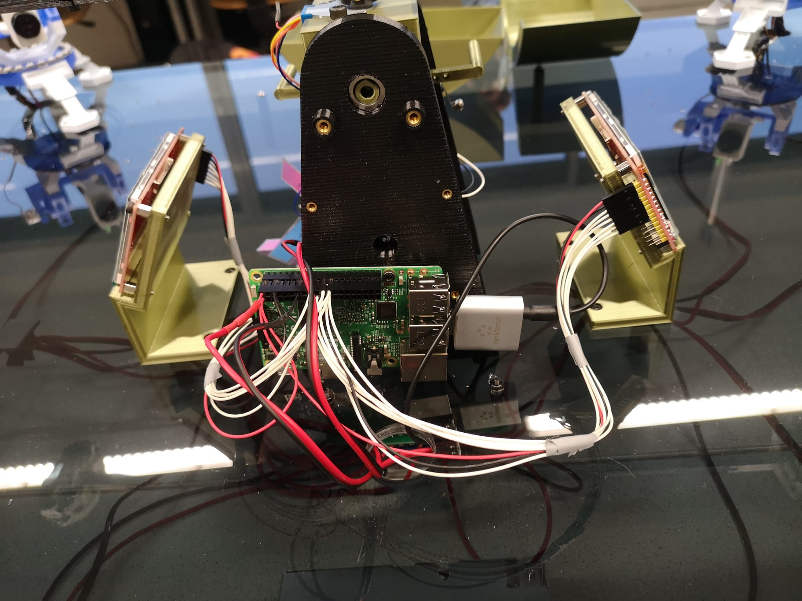

# Display and Sound module

The name of the teams and the points of every team as well as the winner would be shown on a display. Each successful hit would be marked by sound effect.During the game melody [Awakening Game Polychord phase](https://freesound.org/people/SSS_Samples/sounds/360906/) and at the end melody [Jingle_Win_00](https://freesound.org/people/LittleRobotSoundFactory/sounds/270402/) would be played.

## Functionality

The display are controlled by the Raspberry Pi. For this game two 2.2 TFT SPI 240x320  displays are used. Both displays are connected to the Raspberry Pi via Y-Cables. For the usage of the USB sound-card, this card must be connected directly to the USB port Raspberry Pi. Loudspeaker must to be connected to sound card with 3.5 mm jack plugs. Every Sound-effect used in this game were taken from https://freesound.org/. For the mounting of the displays

For information about software characteristics and controlling look here.

## Technical characteristics

| Name             | Parameter            |
| ---------------- | -------------------- |
| Display Color    | RGB 65K color        |
| Screen Size      | 2.2 inch             |
| Type             | TFT                  |
| Driver IC        | ILI9341              |
| Resolution       | 320*240 (Pixel)      |
| Module Interface | 4-wire SPI interface |
| Active Area      | 33.84x45.12(mm)      |

### Circuit (connection to Raspberry Pi)

### 3D-Model of Display bracket

## Components

For a list of all used components see the [components](components.md) section.

## Further informations

All 3D-Models were done with Fusion360 and can be found [here](3D_models/Display).
For information about software characteristics and controlling look here.
