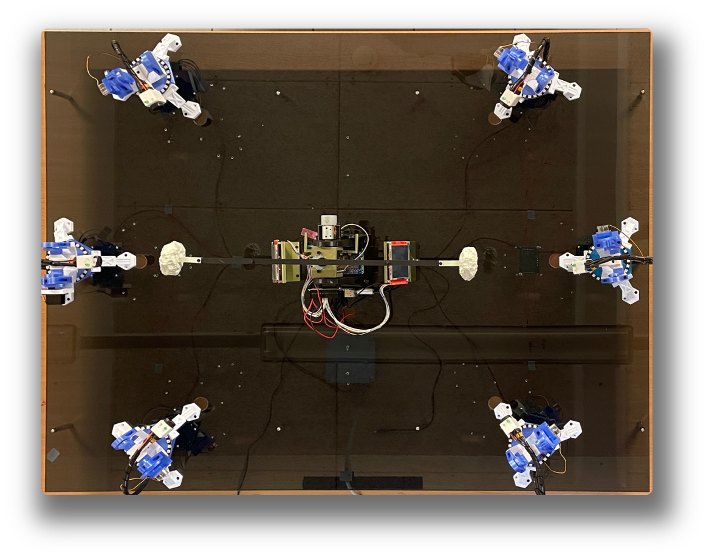

# CrazyComet Instructions

## Preparation

Before starting the game a test calibration is accomplished in order to reset the position of the comets.

## Game-goal

Get more points than the other team to win the game.

## Game-history

Every player gets assigned to a turret with the associated controller. The players try to shoot the rotating object by controlling the turret with the controller (see controls section). For every hit the players get a point. The team wich reaches ten point first wins. One player can only shoot five times in a row. Afterwards the turret needs to cool down for three seconds. When a player shoots the white LED on the turret lights up. After hitting the target the green LED lights up.

## Game-end

The game ends as soon as one team reaches ten points the game ends. The team with ten points wins.

## Controls

- **left joystick:** control turret
- **RT:** shooting
- **B:** ready

