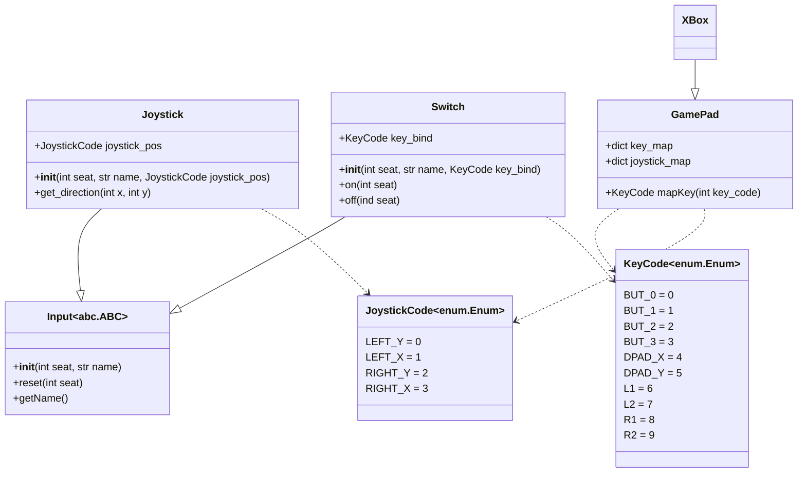
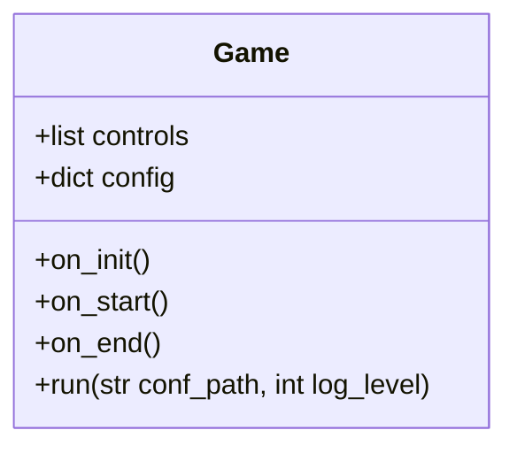
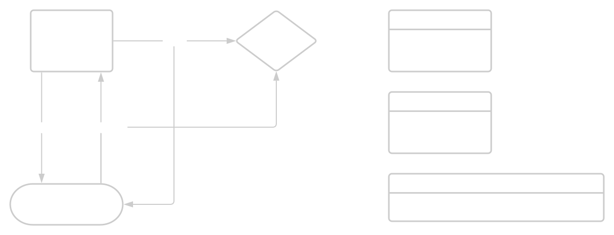

# Game SDK for Controller

## Structure

### Controls

```mermaid
classDiagram
  class Input~abc.ABC~{
    +__init__(int seat, str name)
    +reset(int seat)
    +getName()
  }

  class Joystick{
    +JoystickCode joystick_pos
    +__init__(int seat, str name, JoystickCode joystick_pos)
    +get_direction(int x, int y)
  }
  Joystick --|> Input

  class JoystickCode~enum.Enum~{
    LEFT_Y = 0
    LEFT_X = 1
    RIGHT_Y = 2
    RIGHT_X = 3
  }
  Joystick ..> JoystickCode

  Switch --|> Input
  class Switch{
    +KeyCode key_bind
    +__init__(int seat, str name, KeyCode key_bind)
    +on(int seat)
    +off(ind seat)
  }

  class KeyCode~enum.Enum~{
    BUT_0 = 0
    BUT_1 = 1
    BUT_2 = 2
    BUT_3 = 3
    DPAD_X = 4
    DPAD_Y = 5
    L1 = 6
    L2 = 7
    R1 = 8
    R2 = 9
  }
  Switch ..> KeyCode

  class GamePad {
    +dict key_map
    +dict joystick_map
    +KeyCode mapKey(int key_code)
  }
  GamePad ..> KeyCode
  GamePad ..> JoystickCode

  class XBox {
  }
  XBox --|> GamePad
```

### Game

```mermaid
classDiagram
  class Game{
    +list controls
    +dict config
    +on_init()
    +on_start()
    +on_end()
    +run(str conf_path, int log_level)
  }
```

### MQTT Communication

