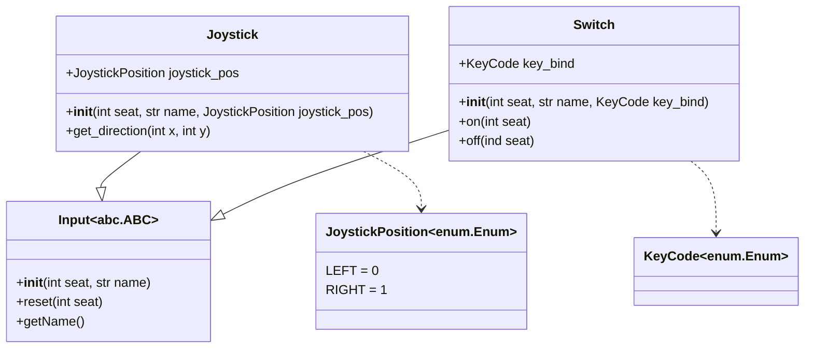
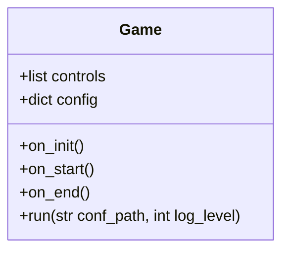

# Game SDK for Controller

## Structure

### Controls

```mermaid
classDiagram
  class Input~abc.ABC~{
    +__init__(int seat, str name)
    +reset(int seat)
    +getName()
  }

  class Joystick{
    +JoystickPosition joystick_pos
    +__init__(int seat, str name, JoystickPosition joystick_pos)
    +get_direction(int x, int y)
  }
  Joystick --|> Input

  class JoystickPosition~enum.Enum~{
    LEFT = 0
    RIGHT = 1
  }
  Joystick ..> JoystickPosition

  Switch --|> Input
  class Switch{
    +KeyCode key_bind
    +__init__(int seat, str name, KeyCode key_bind)
    +on(int seat)
    +off(ind seat)
  }

  class KeyCode~enum.Enum~{
  }
  Switch ..> KeyCode
```
### Game

```mermaid
classDiagram
  class Game{
    +list controls
    +dict config
    +on_init()
    +on_start()
    +on_end()
    +run(str conf_path, int log_level)
  }
```

### MQTT Communication

